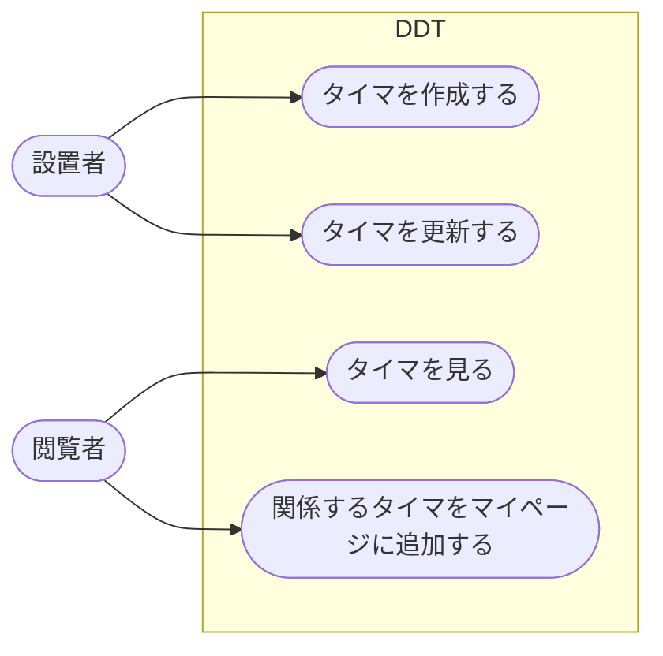

# 準備

## ユースケース

```mermaid
flowchart LR
installer([設置者]) --> create([タイマを作成する])
installer --> update([タイマを更新する])
viewer([閲覧者]) --> view([タイマを見る])
viewer --> register([関係するタイマをマイページに追加する])
subgraph DDT 
create
view
update
register
end
```
